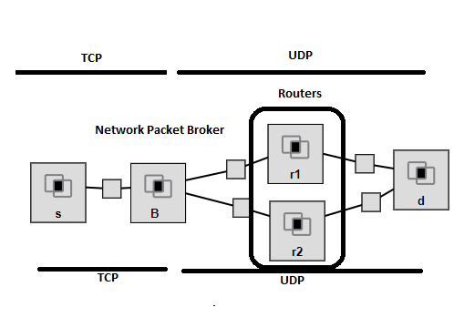

# UDP-TCP Socket Programming



As seen in the topology above:

**Source Node:** s is considered as a source and sends messages to the destination node.

**Destination Node:** d is considered as a data center which receives messages from the source over both r1 and r2.

**Router Nodes:** r1 and r2 is considered as routers.

S-B connection is **TCP**, the rest of the connections are **UDP**. Broker node divides message to the parts and send over both r1 and r2. Destination node merge these parts. 

This program tested in [GENI](https://www.geni.net/) as using 5 device\node remotely via ssh. 

# To run the program
1. In the broker node/device:
```shell
        $ g++ broker.cpp -o broker -std=c++11
        $ ./broker
```
2. In the router 1 node/device: 
```shell
        $ g++ router1.cpp -o router1 -std=c++11
        $ ./router1
```
3. In the router 2 node/device: 
```shell
        $ g++ router2.cpp -o router2 -std=c++11
        $ ./router2
```
4. In the destination node/device:
```shell        
        $ g++ destination.cpp -o destination -std=c++11
        $ ./destination
```
5. In the source node/device: 
```shell    
        $ g++ source.cpp -o source -std=c++11
        $ ./source <message>  
```
